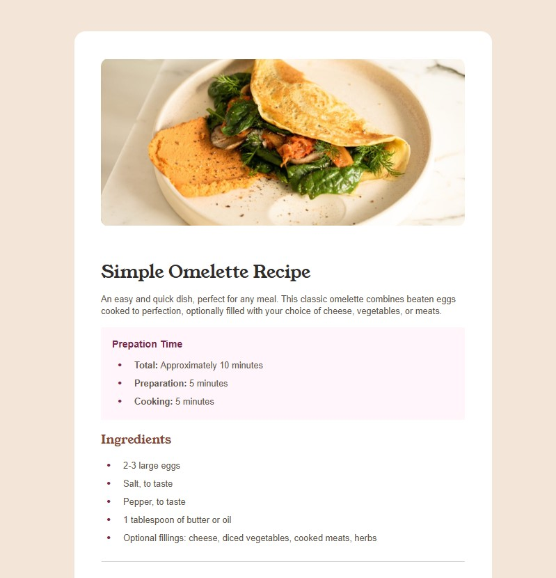
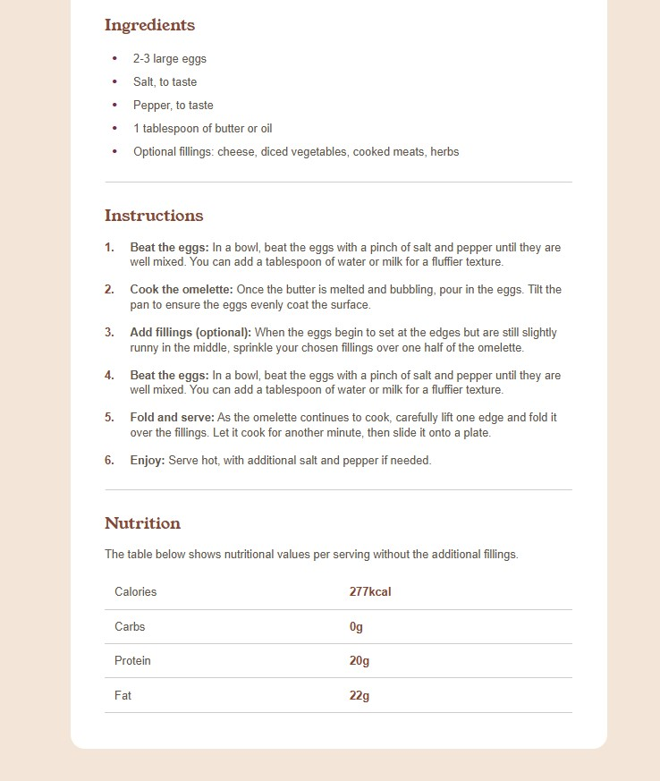
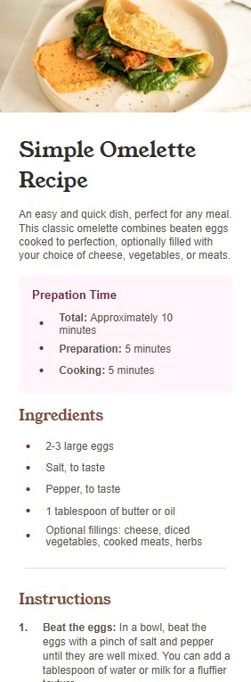

# Frontend Mentor - Recipe page solution

This is a solution to the [Recipe page challenge on Frontend Mentor](https://www.frontendmentor.io/challenges/recipe-page-KiTsR8QQKm). Frontend Mentor challenges help me to improve my coding skills by building realistic projects.

## Table of contents

- [Overview](#overview)
  - [The challenge](#the-challenge)
  - [Screenshot](#screenshot)
  - [Links](#links)
- [My process](#my-process)
  - [Built with](#built-with)
  - [What I learned](#what-i-learned)
  - [Continued development](#continued-development)
- [Author](#author)
- [Acknowledgments](#acknowledgments)


## Overview

### The challenge

Build recipe page with HTML and css with simple responsive for mobile and desktop.

### Screenshot





### Links

- Solution URL: https://www.frontendmentor.io/solutions/recipe-page-layout-using-flexbox-with-basic-responsive-design-i9VCLbk8QR
- Live Site URL: https://pete13232.github.io/recipe-page-challenge/

## My process

### Built with

- Semantic HTML5 markup
- CSS custom properties
- Flexbox
- Mobile-first workflow

### What I learned

I had trouble styling the gap between the bullet and text in an <li> element. At first, I tried using a CSS workaround with the text-indent property, but it didn’t work as expected. So I switched to using Flexbox instead, which solved the issue—it made it much easier to control both the spacing and alignment.

some code snippet, see below:

```html
<div class="list">
  <p class="number">1.</p>
  <p class="list-content"><span>Beat the eggs:</span> In a bowl, beat the eggs with a pinch of salt and pepper
    until they are well mixed.
    You can add a tablespoon of water or milk for a fluffier texture.</p>
</div>
```

```css
.list {
    display: flex;
    gap: 1.4em;
}
```

### Continued development

I found another idea from community that I can use `<ol>`> with
```
ol li::before {
  content: counter(li-counter) ".";
}
```
This is looking better which easily to read for HTML semantic structure. I will apply this concept to my future project.

## Author

- Frontend Mentor - [@pete13232](https://www.frontendmentor.io/profile/pete13232)

## Acknowledgments

Huge thanks to @Marimelle from the Frontend Mentor community — your idea about using gap and margin in the layout component was super helpful!
